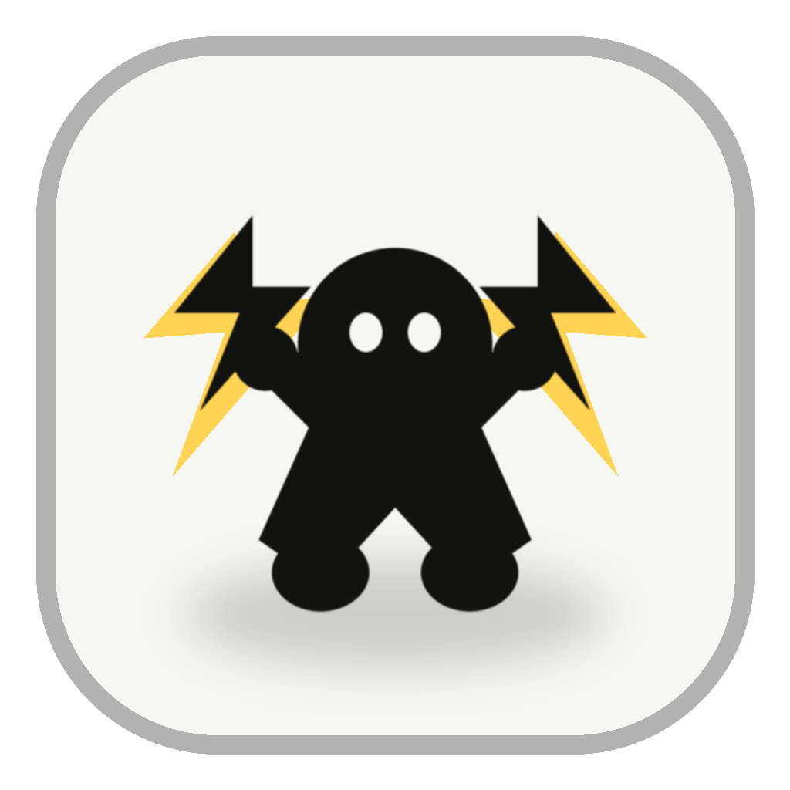

# stayawake

<p align="center">
  
</p>

stayawake is a lightweight macOS menu-bar utility that automatically decides when your Mac should stay awake.

It is designed for long-running work: builds, downloads, renders, scripts, audio playback, fullscreen activity, and focused work apps. When there is no useful activity, it lets macOS sleep normally.

## Preview

The app uses a small character icon in the menu bar. The sleeping character means sleep is allowed; the energized character means stayawake is actively keeping the Mac awake.


## Screenshots

Screenshots are kept out of the main README so the project page stays compact.

See [Screenshots](docs/SCREENSHOTS.md) for the menu, settings tabs, and logs window.

## Features

- Automatic sleep control with no manual toggle required for normal use
- Menu-bar status icon with separate Awake and Sleep states
- Current decision, reason, and recent logs directly in the menu
- Manual keep-awake options for 30 minutes, 1 hour, or until turned off
- Configurable CPU, network, disk, idle, process, foreground-app, and blocklist rules
- Low-resource polling strategy for a small always-on menu-bar app
- English and Simplified Chinese localization
- No cloud service, account, telemetry, or content upload

## Install

The fastest way to install a signed, notarized build is through Homebrew:

```sh
brew tap amoswzw/tap
brew install --cask stayawake
```

You can also download the latest DMG directly from the [GitHub Releases](https://github.com/amoswzw/stayawake/releases/latest) page and drag `stayawake.app` into `/Applications`.

## Requirements

- macOS 13 or later
- Xcode 15 or Swift 5.9 or later

## Build

```bash
swift build -c release
./build-app.sh
open build/stayawake.app
```

`build-app.sh` creates a minimal `.app` bundle at `build/stayawake.app`. The app runs as a menu-bar utility and does not show a Dock icon.

## Usage

Launch the app and click the menu-bar icon.

The menu shows:

- Current state: keeping awake, manual keep-awake, or sleep allowed
- Current reason and next check timing
- Recent logs: the latest 5 meaningful state changes
- Manual keep-awake actions
- Settings and full logs windows
- Quit

The menu-bar icon follows macOS light and dark appearances. The sleeping character means sleep is allowed; the energized character means stayawake is actively keeping the Mac awake.

## Settings

Open **Settings...** from the menu to configure:

- Launch at login
- App language
- Idle threshold
- Sampling and release cooldown
- CPU, network, and disk thresholds
- Task process names
- Foreground work-app allowlist
- Foreground/fullscreen blocklist

Settings are stored locally in `UserDefaults`.

## How It Decides

stayawake collects lightweight system signals and feeds them into a pure policy function.

| Signal | Source |
| --- | --- |
| Idle time | `CGEventSourceSecondsSinceLastEventType` |
| Foreground app | `NSWorkspace.frontmostApplication` |
| Task process names | `sysctl(KERN_PROC_ALL)` |
| Per-core CPU usage | `host_processor_info` with a 60s P75 window |
| Network rate | `getifaddrs` / `if_data` with a 60s P75 window |
| Disk rate | `IOBlockStorageDriver` statistics with a 60s P75 window |
| Audio activity | CoreAudio device running state |
| Fullscreen windows | `CGWindowListCopyWindowInfo` |
| Battery / AC power | `IOPSGetProvidingPowerSourceType` |
| Thermal state | `ProcessInfo.thermalState` |

Decision order:

1. Manual override keeps the Mac awake.
2. Serious or critical thermal state on battery allows sleep.
3. Resource activity or audio keeps the Mac awake.
4. Task process, foreground work app, or fullscreen activity keeps the Mac awake only when paired with recent user input.
5. Probe failures keep the Mac awake to avoid interrupting work.
6. User idle with no activity allows sleep.
7. Otherwise, sleep is allowed.

## Resource Usage

stayawake favors low overhead over high-frequency monitoring.

- Automatic decisions are rechecked after the configured cooldown, defaulting to 120 seconds.
- Manual keep-awake until turned off uses a longer 300-second tick.
- Repeated identical automatic decisions are deduplicated in the log.
- CoreAudio device lists are cached for 5 minutes.
- Logs are kept in memory and capped.

This keeps the app small and quiet while preserving the main goal: avoid interrupting long-running work.

## Privacy

- No Accessibility permission is required.
- No user files, windows, text, browser content, or terminal output are read.
- No data is uploaded.
- The app only reads aggregate system signals such as CPU, network, disk counters, app bundle IDs, process names, idle time, audio activity, and power state.

## Localization

Bundled languages:

- English
- Simplified Chinese

To add another language:

1. Create `Sources/stayawake/Resources/<locale>.lproj/Localizable.strings`.
2. Use `Sources/stayawake/Resources/en.lproj/Localizable.strings` as the template.
3. Add the locale to `CFBundleLocalizations` in `build-app.sh`.

## Project Structure

```text
.
├── Package.swift
├── build-app.sh
├── docs/_config.yml
├── docs/_layouts
├── docs/index.md
├── docs/SCREENSHOTS.md
├── docs/assets
├── docs/screenshots
├── Sources/stayawake
│   ├── App.swift
│   ├── AppCoordinator.swift
│   ├── MenuBarController.swift
│   ├── SettingsView.swift
│   ├── LogsView.swift
│   ├── Policy.swift
│   ├── *Probe.swift
│   └── Resources
│       ├── en.lproj
│       ├── zh-Hans.lproj
│       ├── status-awake-template.png
│       ├── status-sleep-template.png
│       └── stayawake.icns
└── Tests/stayawakeTests
    ├── PolicyTests.swift
    └── EventLogTests.swift
```

`build/`, `.build/`, and Xcode user state are generated locally and should not be committed.

## Tests

```bash
swift test
```

The test suite covers policy decisions, signal derivation, log deduplication, blocklist behavior, and sliding-window behavior.

## Release Notes

This repository builds a local, unsigned `.app` bundle. If you plan to distribute binaries, sign and notarize the app with your Apple Developer account.

Release requirements:

- GitHub Actions must be enabled for the repository.
- The release tag must use semantic version format, for example `v0.1.0`.
- `CFBundleShortVersionString` in `build-app.sh` must match the release tag without the leading `v`.
- `swift test` must pass on the GitHub macOS runner.
- `./build-app.sh` must produce `build/stayawake.app`.
- Unsigned DMG release requires no Apple credentials, but users may see Gatekeeper warnings.
- Public distribution should use a Developer ID certificate and Apple notarization credentials.

GitHub Actions builds and publishes a DMG only when the **Release macOS DMG** workflow is triggered manually from the Actions tab. Enter the release tag (for example `v0.1.0`) and run the workflow. The workflow runs tests, builds `stayawake.app`, packages `stayawake-0.1.0-macos.dmg`, writes a SHA-256 checksum, and uploads both files to the GitHub Release.

### Signing and notarization

For public distribution outside the Mac App Store, configure these GitHub Actions repository secrets before creating the release tag:

| Secret | Value |
| --- | --- |
| `APPLE_CERTIFICATE_P12_BASE64` | Base64-encoded `Developer ID Application` `.p12` certificate |
| `APPLE_CERTIFICATE_PASSWORD` | Password used when exporting the `.p12` certificate |
| `APPLE_ID` | Apple ID email used for notarization |
| `APPLE_APP_SPECIFIC_PASSWORD` | App-specific password for that Apple ID |
| `APPLE_TEAM_ID` | Apple Developer Team ID |

On your Mac, export the certificate from Keychain Access, then encode it:

```bash
base64 -i DeveloperIDApplication.p12 | pbcopy
```

Paste the copied value into `APPLE_CERTIFICATE_P12_BASE64`.

When these secrets are present, the workflow signs the app, signs the DMG, submits the DMG to Apple notarization, staples the notarization ticket, and then uploads the final DMG. Without these secrets, the workflow still builds an unsigned DMG.

This workflow uses Developer ID distribution. Mac App Store distribution is a separate path and requires App Sandbox, App Store signing, provisioning, and App Store Connect submission.

Before publishing your own fork, review:

- `CFBundleIdentifier` in `build-app.sh`
- `CFBundleShortVersionString` in `build-app.sh`
- The copyright holder in `LICENSE`

## License

MIT. See [LICENSE](LICENSE).
