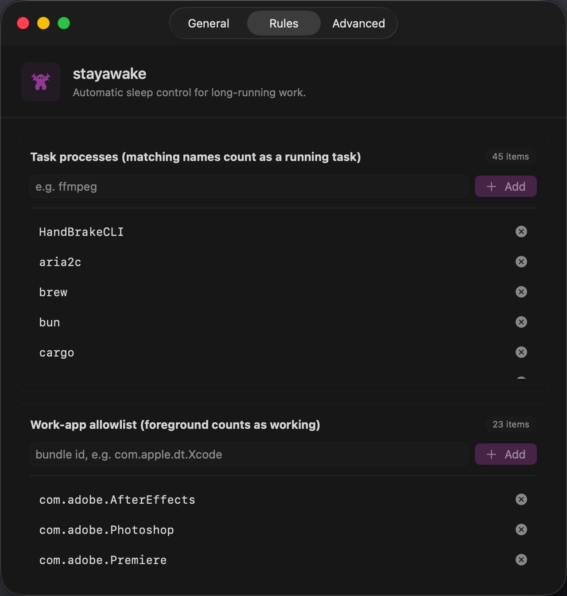
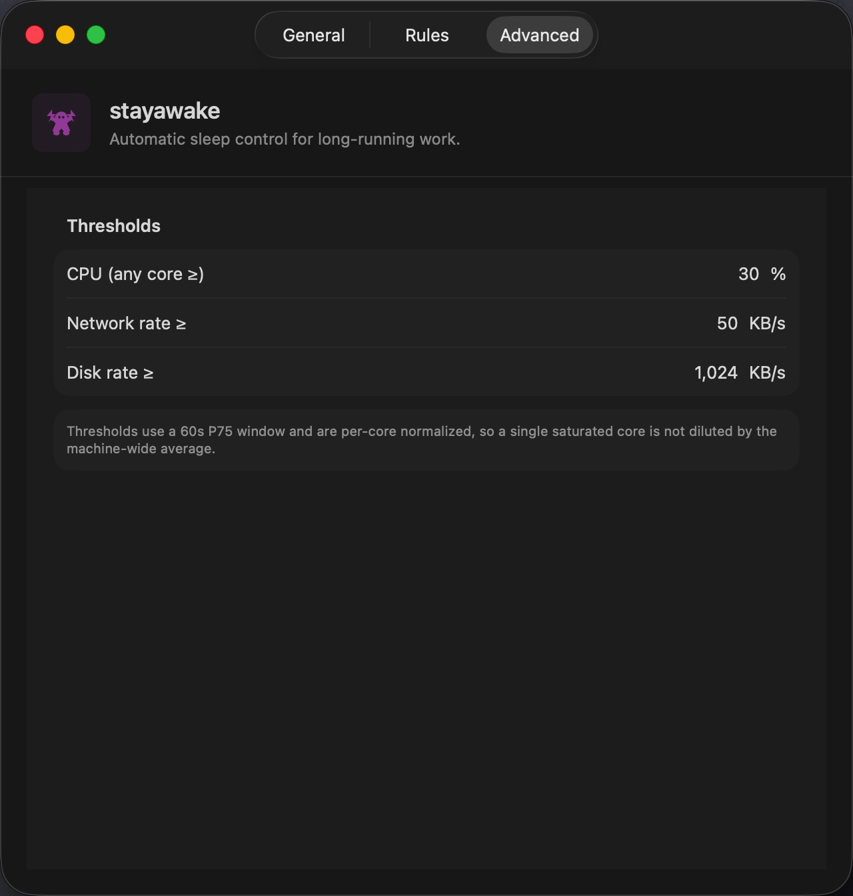

<section class="page">
  

    
 product screenshots

    <h1>Small menu, clear decisions.</h1>
    
The app keeps the main workflow in the menu: current state, reason, next check, recent logs, and quick access to settings.

    

      <a class="button secondary" href="./">Back to home</a>
      <a class="button" href="{{ site.repository_url }}/releases/latest">Download latest DMG</a>
    

  

  

    <figure class="shot-card">
      
      <figcaption>Menu bar current state and latest logs</figcaption>
    </figure>

    <figure class="shot-card">
      
      <figcaption>Settings general controls</figcaption>
    </figure>

    <figure class="shot-card">
      
      <figcaption>Rules processes and app lists</figcaption>
    </figure>

    <figure class="shot-card">
      
      <figcaption>Advanced resource thresholds</figcaption>
    </figure>

    <figure class="shot-card">
      
      <figcaption>Logs colored status details</figcaption>
    </figure>
  

  

</section>
