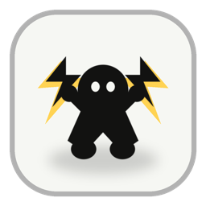
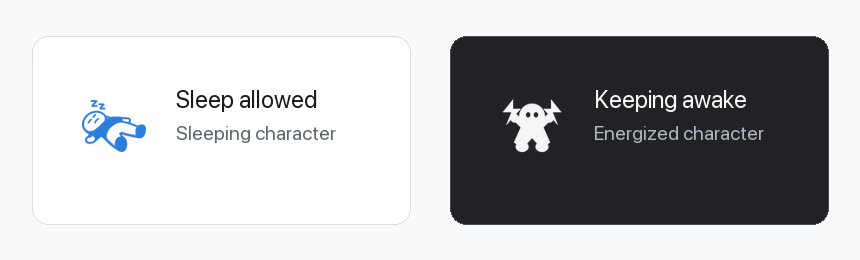
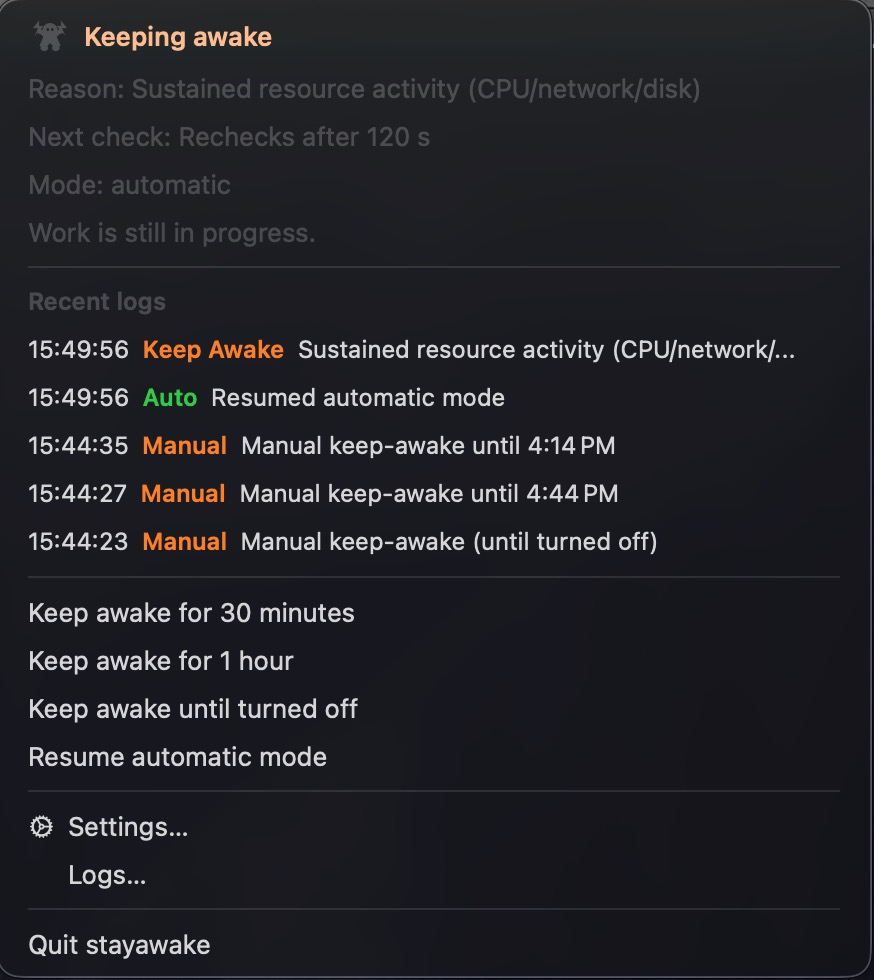
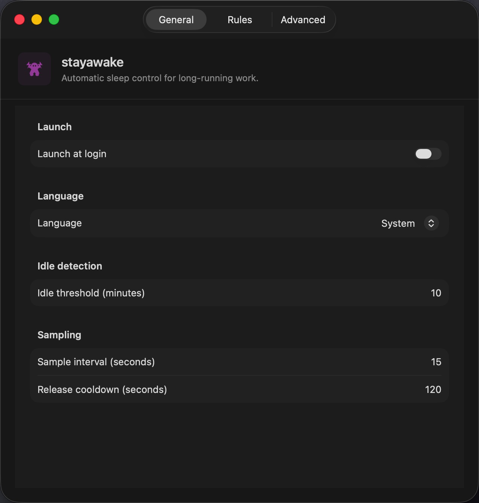
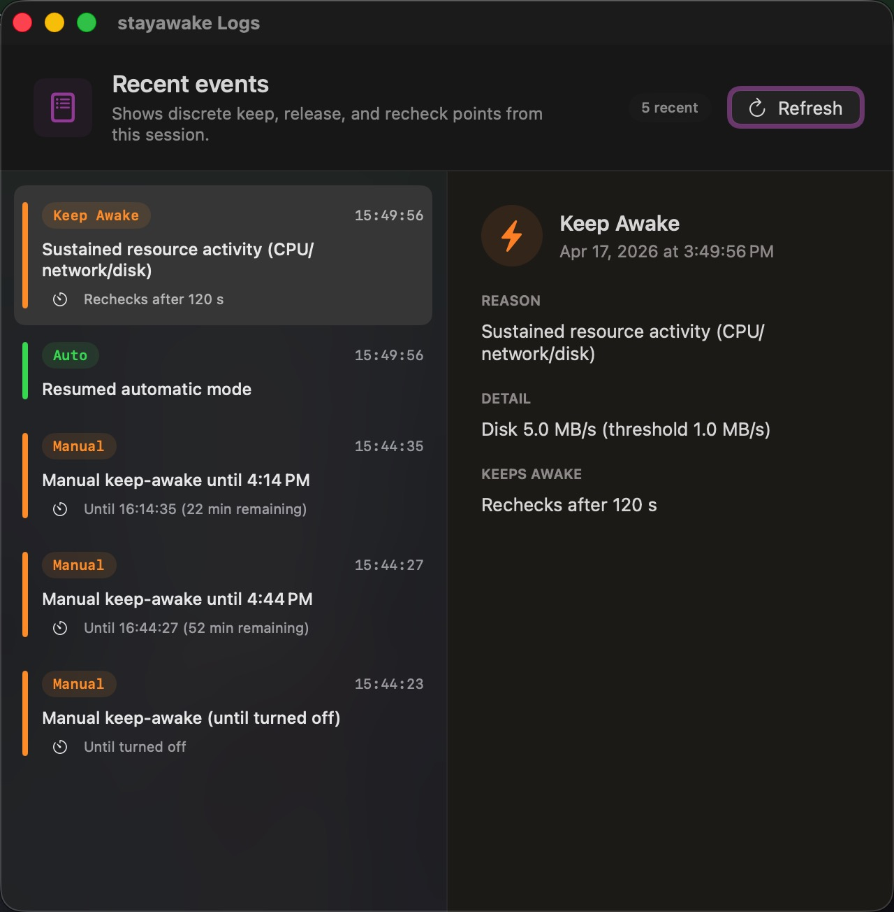

<section class="hero">
  <div>
    <p class="eyebrow"><span class="pulse"></span> macOS menu-bar utility</p>
    <h1>Awake when work is alive.</h1>
    <p class="lede">stayawake watches lightweight system signals, keeps long-running work safe, and steps aside when your Mac can sleep.</p>
    <div class="actions">
      <a class="button" href="#install">Install with Homebrew</a>
      <a class="button secondary" href="{{ site.repository_url }}/releases/latest">Download latest DMG</a>
      <a class="button secondary" href="{{ site.repository_url }}">View source</a>
    </div>
    <ul class="quick-facts" aria-label="Project highlights">
      <li><strong>13+</strong><span>macOS</span></li>
      <li><strong>0</strong><span>cloud services</span></li>
      <li><strong>5</strong><span>recent logs in menu</span></li>
    </ul>
  </div>

  <div class="status-demo" aria-label="stayawake menu preview">
    <div class="desktop-strip">
      <span>Fri 16:20</span>
      
    </div>
    <div class="menu-window">
      <div class="menu-row main-state">
        <span class="dot"></span>
        <span>
          <span class="row-title">Awake</span>
          <span class="row-note">CPU and network activity detected</span>
        </span>
        <span class="tag">ACTIVE</span>
      </div>
      <div class="menu-row">
        <span class="dot warn"></span>
        <span>
          <span class="row-title">Next check</span>
          <span class="row-note">Low-resource cooldown is running</span>
        </span>
        <span class="tag warn">120s</span>
      </div>
      <div class="log-row">
        <span class="dot"></span>
        <span>
          <span class="row-title">Build process matched</span>
          <span class="row-note">Recent input keeps work protected</span>
        </span>
        <span class="tag">Awake</span>
      </div>
      <div class="log-row">
        <span class="dot sleep"></span>
        <span>
          <span class="row-title">Idle window cleared</span>
          <span class="row-note">Sleep allowed when signals are quiet</span>
        </span>
        <span class="tag sleep">Sleep</span>
      </div>
    </div>
  </div>
</section>

<section class="section" id="install">
  <div class="section-header">
    <h2>Install in one command.</h2>
    <p>Use Homebrew for the shortest install path, or download the latest DMG from GitHub Releases.</p>
  </div>
  <div class="install-options">
    <div>
      <h3>Homebrew</h3>

```sh
brew install --cask amoswzw/tap/stayawake
```

    </div>
    <div>
      <h3>Direct download</h3>
      <p>Grab the latest DMG from GitHub Releases and drag <code>stayawake.app</code> into <code>/Applications</code>.</p>
      <div class="actions">
        <a class="button secondary" href="{{ site.repository_url }}/releases/latest">Open Releases</a>
      </div>
    </div>
  </div>
</section>

<section class="section alt">
  <div class="section-header">
    <h2>One tiny icon, two clear states.</h2>
    <p>The character changes with the decision, and the settings icon follows the same visual language.</p>
  </div>
  <div class="status-preview">
    
    <div class="status-copy">
      <div class="state-line">
        <strong>Awake</strong>
        <span>Work is active, so stayawake holds a power assertion.</span>
      </div>
      <div class="state-line sleep">
        <strong>Sleep</strong>
        <span>No useful activity is detected, so macOS can sleep normally.</span>
      </div>
    </div>
  </div>
</section>

<section class="section">
  <div class="section-header">
    <h2>Signals, not noise.</h2>
    <p>The policy favors low overhead and meaningful decisions over constant polling.</p>
  </div>
  <div class="signal-rail">
    <div class="signal">
      <span class="stripe"></span>
      <strong>Resources</strong>
      <p>CPU, network, disk, and audio activity keep long tasks uninterrupted.</p>
    </div>
    <div class="signal">
      <span class="stripe teal"></span>
      <strong>Context</strong>
      <p>Foreground work apps, fullscreen windows, and task process names add intent.</p>
    </div>
    <div class="signal">
      <span class="stripe warn"></span>
      <strong>Cooldown</strong>
      <p>Automatic checks use a release cooldown to reduce always-on resource usage.</p>
    </div>
    <div class="signal">
      <span class="stripe sleep"></span>
      <strong>Privacy</strong>
      <p>No account, no telemetry, no uploaded data, and no Accessibility permission.</p>
    </div>
  </div>
</section>

<section class="section alt">
  <div class="section-header">
    <h2>Menu first, logs one click away.</h2>
    <p>The menu opens directly to the current state, reason, next check timing, and recent status history.</p>
  </div>
  <div class="screenshot-grid">
    <a class="shot-link featured" href="SCREENSHOTS.html">
      
      <span class="shot-label">Menu bar <span>current state</span></span>
    </a>
    <div class="shot-stack">
      <a class="shot-link" href="SCREENSHOTS.html">
        
        <span class="shot-label">Settings <span>general</span></span>
      </a>
      <a class="shot-link" href="SCREENSHOTS.html">
        
        <span class="shot-label">Logs <span>details</span></span>
      </a>
    </div>
  </div>
</section>

<section class="section">
  <div class="privacy-band">
    <div>
      <h2>Local by design.</h2>
      <p>stayawake reads aggregate macOS signals and stores settings locally. It does not inspect file content, browser pages, terminal output, or window text.</p>
      <div class="actions">
        <a class="button" href="{{ site.repository_url }}/releases/latest">Download</a>
        <a class="button secondary" href="SCREENSHOTS.html">Open screenshots</a>
      </div>
    </div>
    <ul class="privacy-list">
      <li>No cloud service</li>
      <li>No account or telemetry</li>
      <li>No Accessibility permission</li>
      <li>English and Simplified Chinese</li>
    </ul>
  </div>
</section>
